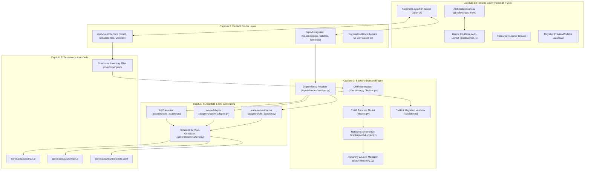
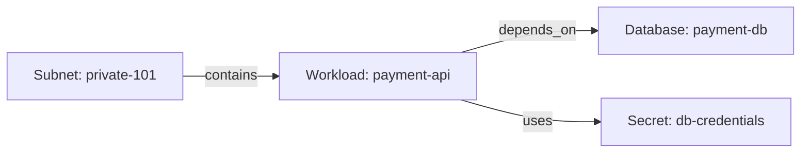
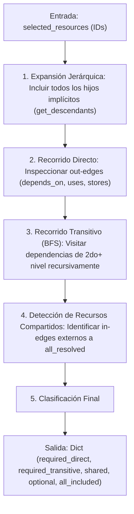
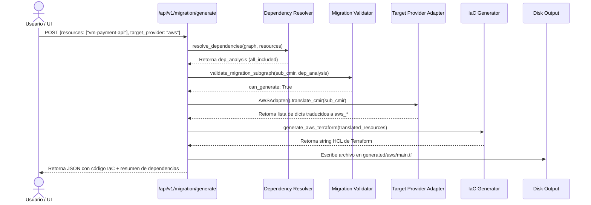
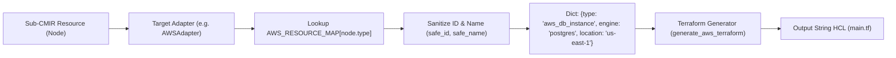
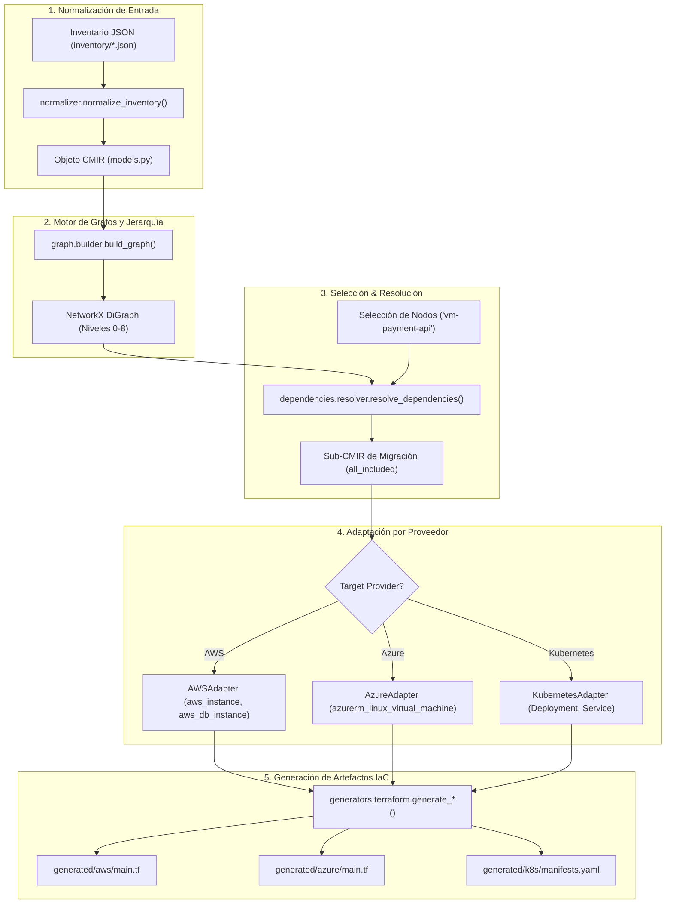

# CloudMove — Arquitectura interna, CMIR, traducción y funcionalidades

**Capstone Project in IT · Universidad EAFIT · 2026-2**  
**Autores:** Luis Alejandro Castrillón Pulgarín & Sara López Marín  
**Documento Técnico Interno de Referencia**  

---

## 1. Resumen ejecutivo

**CloudMove** es una plataforma de ingeniería para la abstracción de arquitectura cloud, navegación jerárquica de infraestructura, migración selectiva de subgrafos de trabajo y generación automática de Infraestructura como Código (IaC).

### Propósito del Sistema
El propósito central de CloudMove es desacoplar el modelo semántico de una arquitectura de infraestructura de la sintaxis y servicios específicos de un proveedor en particular (AWS, Azure, Kubernetes, On-Premise). En lugar de construir traductores rígidos 1-a-1 ($N \times M$ combinaciones), CloudMove introduce el modelo de representación intermedia neutral **CMIR (CloudMove Intermediate Representation)**.

### Problema que Resuelve
1. **Traducciones Monolíticas (Lift-and-Shift)**: Las herramientas comerciales nativas mueven servidores completos en bloque. CloudMove permite aislar subconjuntos (subgrafos) de infraestructura.
2. **Omisión de Dependencias Ocultas**: Al seleccionar una aplicación, el sistema rastrea automáticamente sus dependencias directas, transitivas y de infraestructura compartida (redes, bases de datos, almacenamiento).
3. **Reescritura Manual de Manifiestos**: Elimina la necesidad de traducir manualmente configuraciones entre diferentes nubes mediante adaptadores intermedios.

### Flujo Principal de Procesamiento

```text
Inventario JSON (On-Premise / Cloud)
        ↓
Normalización Semántica & Inferencia de Niveles
        ↓
Modelo Semántico Neutral CMIR (Pydantic v2)
        ↓
Grafo Jerárquico de Conocimiento (NetworkX DiGraph 0-8)
        ↓
Motor de Resolución de Dependencias (BFS / DFS Traversal)
        ↓
Selección & Aislamiento de Subgrafo (Sub-CMIR)
        ↓
Adaptador de Traducción al Proveedor Destino (AWS / Azure / K8s)
        ↓
Generador de Código IaC (Terraform HCL / Kubernetes YAML)
```

---

## 2. Arquitectura actual

La solución actual de CloudMove opera como una arquitectura desacoplada de 3 capas: **Cliente Web (React 19)**, **Servidor API REST (FastAPI / Python 3.14)** y **Artefactos de Infraestructura (JSON / HCL / YAML)**.



---

## 3. Estructura del proyecto

```text
CapstoneProject_TI/
├── backend/                            # Motor Backend principal en Python
│   ├── app/
│   │   ├── main.py                     # Instancia FastAPI, middlewares CORS/Logging y rutas legacy
│   │   ├── config.py                   # Ajustes globales y paths de inventarios JSON/salida
│   │   ├── adapters/                   # Traductores del modelo neutro a proveedores
│   │   │   ├── base.py                 # Clase base abstracta BaseProviderAdapter
│   │   │   ├── aws_adapter.py          # Adaptador de tipos CMIR a tipos HashiCorp AWS
│   │   │   ├── azure_adapter.py        # Adaptador de tipos CMIR a tipos HashiCorp AzureRM
│   │   │   └── k8s_adapter.py          # Adaptador de cargas CMIR a Kinds nativos de Kubernetes
│   │   ├── api/
│   │   │   └── routers/
│   │   │       ├── architecture.py     # Endpoints REST para consulta de grafo, breadcrumbs e hijos
│   │   │       └── migration.py        # Endpoints REST para dependencias, validación y generación IaC
│   │   ├── cmir/                       # Capa del Modelo Semántico Neutral
│   │   │   ├── models.py               # Esquemas Pydantic v2 (CMIRNode, CMIRRelationship, CMIR)
│   │   │   ├── builder.py              # Inferencia de niveles y construcción de CMIR
│   │   │   ├── normalizer.py           # Entrada de diccionarios JSON a objetos CMIR
│   │   │   └── validator.py            # Validación de integridad referencial de nodos
│   │   ├── dependencies/               # Motor de resolución de dependencias
│   │   │   ├── resolver.py             # Algoritmo BFS/DFS de recorrido sobre NetworkX
│   │   │   └── validator.py            # Validación de viabilidad de subgrafo de migración
│   │   ├── generators/                 # Generadores de sintaxis HCL y YAML
│   │   │   └── terraform.py            # Emisión de bloques HCL Terraform y Manifiestos K8s
│   │   ├── graph/                      # Integración con la librería NetworkX
│   │   │   ├── builder.py              # Conversión de CMIR a networkx.DiGraph
│   │   │   ├── hierarchy.py            # Cálculo de breadcrumbs, descendientes y filtros por nivel
│   │   │   └── selector.py             # Filtrado de subgrafos aislados
│   │   ├── inventory/                  # Directorio interno de respaldo
│   │   └── translators/                # Módulos legacy de traducción directa
│   │       ├── aws.py
│   │       └── gcp.py
│   ├── requirements.txt                # Dependencias (fastapi, networkx, pydantic, uvicorn)
│   └── tests/                          # Suite de pruebas unitarias pytest
│       ├── test_cmir.py
│       ├── test_dependencies.py
│       ├── test_graph.py
│       └── test_iac.py
├── docs/                               # Documentación técnica y auditorías
│   ├── PROJECT_AUDIT.md                # Auditoría del proyecto contra Sprint 0
│   └── CLOUDMOVE_INTERNAL_ARCHITECTURE.md # Este documento de arquitectura interna
├── frontend/                           # Aplicación cliente web React 19 + Vite
│   ├── package.json                    # Dependencias JS (@xyflow/react, dagre, lucide-react)
│   ├── src/
│   │   ├── App.jsx                     # Coordinador de estado global y llamadas API
│   │   ├── main.jsx                    # Punto de entrada React DOM
│   │   ├── components/
│   │   │   ├── architecture/           # ArchitectureCanvas, ArchitectureNode, CanvasToolbar
│   │   │   ├── inspector/              # ResourceInspector y pestañas de dependencias
│   │   │   ├── layout/                 # AppShell, Header, Sidebar, Breadcrumbs
│   │   │   └── migration/              # MigrationPreviewModal, IaCViewer
│   │   ├── styles/                     # Tokens CSS y main.css (Pimeweb Clean Design)
│   │   └── utils/                      # Algoritmo de auto-layout Dagre (graphLayout.js)
├── generated/                          # Directorio de salida de código IaC ejecutable
│   ├── aws/main.tf
│   ├── azure/main.tf
│   └── k8s/manifests.yaml
└── inventory/                          # Inventarios de arquitectura JSON fuente (Fuentes de Verdad)
    ├── enterprise-multicloud-example.json
    ├── onprem-enterprise-example.json
    └── onprem-example.json
```

---

## 4. CMIR — Explicación profunda

### ¿Qué significa CMIR?
**CMIR** corresponde a **CloudMove Intermediate Representation** (Representación Intermedia de CloudMove). Es un modelo de datos agnóstico y semántico diseñado específicamente para representar topologías de infraestructura, jerarquías de contenedores y dependencias entre servicios sin depender de la nomenclatura de ningún proveedor de nube.

### ¿Por qué existe y qué problema resuelve?
En una traducción de infraestructura tradicional sin modelo intermedio, conectar $N$ proveedores de origen con $M$ proveedores destino exige implementar $N \times M$ traductores punto a punto directos:

```text
Enfoque Rígido Tradicional (N x M = 12 Traductores):
On-Premise ──> AWS
On-Premise ──> Azure
On-Premise ──> GCP
AWS        ──> Azure
AWS        ──> GCP
AWS        ──> On-Premise
Azure      ──> AWS
Azure      ──> GCP
Azure      ──> On-Premise
GCP        ──> AWS
GCP        ──> Azure
GCP        ──> On-Premise
```

Al introducir el modelo semántico intermedio **CMIR**, la complejidad se reduce a $N + M$ adaptadores:

```text
Enfoque Desacoplado con CMIR (N + M = 7 Adaptadores):

  On-Premise ────┐                     ┌────> AWS Terraform
  AWS Cloud ─────┼───> [ C M I R ] ────┼────> Azure Terraform
  Azure Cloud ───┤   (Modelo Neutro)   └────> Kubernetes Manifests
  GCP Cloud ─────┘
```

---

## 5. Modelo interno del CMIR

El modelo de dominio está definido formalmente en `backend/app/cmir/models.py` utilizando Pydantic v2.

### 1. Clase `CMIRNode` (Alias `Resource`)
Representa una entidad o recurso individual de la arquitectura (desde una nube hasta un microservicio o base de datos).

| Campo | Tipo Python | Requerido | Valor por Defecto | Propósito / Semántica |
| :--- | :--- | :---: | :--- | :--- |
| `id` | `str` | **Sí** | N/A | Identificador único del recurso (ej. `vm-payment-db-01`). |
| `name` | `str` | **Sí** | N/A | Nombre legible del recurso (ej. `Payment Database Primary`). |
| `type` | `str` | **Sí** | N/A | Tipo semántico neutro (ej. `database`, `workload`, `subnet`). |
| `category` | `Optional[str]` | No | `"resource"` | Categoría general (`resource`, `container`, `boundary`). |
| `parent_id` | `Optional[str]` | No | `None` | ID del contenedor padre en la jerarquía (ej. `subnet-backend`). |
| `children_ids` | `List[str]` | No | `[]` | Lista de IDs de nodos hijos contenidos. |
| `level` | `int` | No | `0` | Nivel jerárquico asignado (0 a 8). |
| `provider` | `Optional[str]` | No | `"aws"` | Proveedor de origen (`on-premise`, `aws`, `azure`). |
| `platform` | `Optional[str]` | No | `None` | Plataforma subyacente (ej. `vmware`, `kubernetes`). |
| `engine` | `Optional[str]` | No | `None` | Motor específico (ej. `postgres`, `redis`, `nginx`). |
| `location` | `Optional[str]` | No | `"us-east-1"` | Región o zona de disponibilidad. |
| `environment` | `Optional[str]` | No | `"production"` | Entorno de despliegue (`production`, `staging`). |
| `status` | `str` | No | `"DISCOVERED"` | Estado de salud o ciclo de vida (`RUNNING`, `HEALTHY`). |
| `is_shared` | `bool` | No | `False` | Indica si es una dependencia compartida entre varios subgrafos. |
| `security` | `Dict[str, Any]`| No | `{}` | Parámetros de seguridad y grupos de acceso. |
| `network` | `Dict[str, Any]`| No | `{}` | Direccionamiento IP, puertos y CIDR. |
| `metadata` | `Dict[str, Any]`| No | `{}` | Atributos adicionales flexibles. |

### 2. Clase `CMIRRelationship` (Alias `Relationship`)
Representa un enlace o dependencia direccional entre dos nodos `CMIRNode`.

| Campo | Tipo Python | Requerido | Valor por Defecto | Propósito / Semántica |
| :--- | :--- | :---: | :--- | :--- |
| `source` | `str` | **Sí** | N/A | ID del recurso origen del enlace. |
| `target` | `str` | **Sí** | N/A | ID del recurso destino del enlace. |
| `type` | `str` | No | `"depends_on"` | Tipo semántico de relación (`depends_on`, `contains`, `uses`, `stores`). |
| `metadata` | `Dict[str, Any]`| No | `{}` | Metadatos de la relación (ej. puerto, protocolo). |

### 3. Clase `CMIR`
Contenedor raíz del modelo completo de arquitectura.

| Campo | Tipo Python | Requerido | Valor por Defecto | Propósito / Semántica |
| :--- | :--- | :---: | :--- | :--- |
| `name` | `str` | **Sí** | N/A | Nombre del escenario de arquitectura. |
| `provider` | `str` | **Sí** | N/A | Proveedor dominante o ámbito (`on-premise`, `multi-cloud`). |
| `version` | `str` | No | `"2.0"` | Versión del esquema del modelo CMIR. |
| `resources` | `List[CMIRNode]`| **Sí** | N/A | Lista completa de recursos de la arquitectura. |
| `relationships`| `List[CMIRRelationship]`| **Sí** | N/A | Lista de relaciones entre recursos. |
| `metadata` | `Dict[str, Any]`| No | `{}` | Metadatos globales de la arquitectura. |

---

## 6. Recurso CMIR y tipos de relaciones

### Representación Estructurada de un Recurso
Cada recurso en CMIR encapsula tanto atributos de **identidad** como de **ubicación jerárquica** y **configuración técnica**:

```json
{
  "id": "vm-payment-api-01",
  "name": "Payment API Workload",
  "type": "workload",
  "category": "resource",
  "parent_id": "subnet-private-101",
  "level": 7,
  "provider": "on-premise",
  "platform": "vmware",
  "engine": "nodejs",
  "location": "datacenter-east",
  "environment": "production",
  "status": "RUNNING",
  "is_shared": false,
  "network": { "ip": "10.0.1.15", "port": 8080 },
  "metadata": { "memory_mb": 4096, "cpu_cores": 2 }
}
```

### Relaciones Semánticas Soportadas



- **`contains` / `parent_of`**: Relación jerárquica estructural. El nodo origen contiene físicamente al nodo destino (ej. Subnet contiene a VM).
- **`depends_on`**: Dependencia técnica dura. El nodo origen no puede funcionar sin el nodo destino (ej. API depende de DB).
- **`uses` / `connects_to`**: Dependencia de red o comunicación (ej. API se conecta a caché Redis).
- **`stores`**: Dependencia de persistencia de datos (ej. Workload almacena en S3 / NFS).

---

## 7. Normalization Layer

Ubicada en `backend/app/cmir/normalizer.py` y `backend/app/cmir/builder.py`, la capa de normalización recibe inventarios JSON arbitrarios y construye una instancia CMIR tipada.

### Inferencia de Niveles Jerárquicos (`TYPE_LEVEL_MAP`)
Si un recurso de entrada no especifica su nivel explícitamente, `builder.py` lo infiere automáticamente mediante la tabla `TYPE_LEVEL_MAP`:

```python
TYPE_LEVEL_MAP = {
    "cloud": 0, "provider": 1,
    "region": 2, "datacenter": 2,
    "network": 3, "vpc": 3, "subnet": 3, "security_group": 3,
    "cluster": 4, "kubernetes_cluster": 4,
    "namespace": 5, "kubernetes_namespace": 5,
    "application": 6,
    "service": 7, "workload": 7,
    "compute": 8, "database": 8, "cache": 8, "storage": 8, "queue": 8
}
```

---

## 8. Validation Layer

Ubicada en `backend/app/cmir/validator.py`, la capa de validación analiza la consistencia semántica del modelo:

1. **Validación de Presencia**: Verifica que la lista `resources` no esté vacía.
2. **Duplicidad de IDs**: Garantiza que no existan dos recursos con el mismo `id`.
3. **Padres Huérfanos & Autoreferenciación**: Comprueba que si un nodo tiene `parent_id`, este exista dentro del CMIR y no sea él mismo.
4. **Relaciones Huérfanas**: Verifica que `source` y `target` en cada relación existan en la lista de recursos.
5. **Detección de Recursos Compartidos**: Emite advertencias (`warnings`) si un nodo marcado como `is_shared=True` es referenciado por múltiples componentes.

---

## 9. Graph Builder (NetworkX Integration)

El módulo `backend/app/graph/builder.py` transforma la estructura de datos `CMIR` en un **Grafo Dirigido (`networkx.DiGraph`)**:

```python
def build_graph(cmir: CMIR) -> nx.DiGraph:
    graph = nx.DiGraph()
    for resource in cmir.resources:
        graph.add_node(resource.id, **resource.model_dump())
        if resource.parent_id:
            graph.add_edge(resource.parent_id, resource.id, type="contains", is_hierarchy=True)
    
    for rel in cmir.relationships:
        graph.add_edge(rel.source, rel.target, type=rel.type, is_hierarchy=(rel.type in ("contains", "parent_of")))
    return graph
```

---

## 10. Jerarquía y Niveles de Arquitectura (0 a 8)

El modelo organiza la infraestructura en una jerarquía estricta de 9 niveles (0 a 8) que permite la navegación por drill-down:

| Nivel | Categoría | Tipos de Recurso Asociados | Ejemplo |
| :---: | :--- | :--- | :--- |
| **0** | Cloud Scope | `cloud`, `enterprise` | Multi-Cloud Enterprise Scope |
| **1** | Provider | `provider`, `aws`, `azure`, `on-premise` | On-Premise Enterprise Datacenter |
| **2** | Region / Datacenter | `region`, `datacenter`, `availability_zone` | Main Corporate Datacenter |
| **3** | Network Boundary | `network`, `vpc`, `subnet`, `security_group` | Backend Subnet 10.0.1.0/24 |
| **4** | Cluster / Platform | `cluster`, `kubernetes_cluster`, `vmware_host` | VMware ESXi Cluster / EKS Cluster |
| **5** | Namespace / Unit | `namespace`, `kubernetes_namespace`, `rack` | Production Namespace / Server Rack |
| **6** | Application Scope | `application`, `system_module` | Payment Processing System |
| **7** | Workload / Service | `workload`, `service`, `virtual_machine` | Payment API Microservice VM |
| **8** | Component / Resource | `compute`, `database`, `storage`, `cache`, `queue` | PostgreSQL Database / Redis Cache |

---

## 11. Visualización Frontend & Layout Dagre

En la capa cliente (`frontend/src/`):

1. **Recepción del Grafo**: `App.jsx` realiza un fetch a `GET /api/v1/architecture/graph`.
2. **Visualización React Flow**: `ArchitectureCanvas.jsx` renderiza los nodos usando el componente personalizado `ArchitectureNode.jsx`.
3. **Auto-Layout Dagre**: `utils/graphLayout.js` calcula las coordenadas 2D $(x, y)$ de cada nodo aplicando un algoritmo jerárquico Top-to-Bottom (`TB`) con un espaciado inter-nodo de `300px` y de rango de `200px`, garantizando **cero superposición de nodos y bordes**.
4. **Controles Interactivos**: Soporta zoom/pan, fitView, resaltado de selección (`Ctrl+Click`), filtro por niveles jerárquicos y navegación por breadcrumbs.

---

## 12. Dependency Engine (Algoritmo de Recorrido BFS/DFS)

El módulo `backend/app/dependencies/resolver.py` calcula el alcance autónomo de migración para cualquier subconjunto de recursos seleccionados:



### Clasificación de Dependencias Retornadas
- **`selected`**: Lista de recursos seleccionados inicialmente + sus hijos implícitos.
- **`required_direct`**: Nodos destino de primer nivel requeridos por la selección.
- **`required_transitive`**: Nodos destino encadenados a partir de los directos.
- **`shared_dependencies`**: Nodos requeridos que también tienen dependencias entrantes desde recursos NO incluidos en la migración.
- **`optional_dependencies`**: Relaciones marcadas como no críticas (`optional_depends_on`).
- **`all_included`**: Unión completa de todos los nodos necesarios para garantizar un subgrafo funcional.

---

## 13. Ejemplo completo de resolución de dependencias

Tomando como referencia el inventario `inventory/onprem-enterprise-example.json`:

1. **Entrada del Usuario**: Selecciona únicamente el nodo Workload `vm-payment-api`.
2. **Paso 1 (Recorrido Directo)**:
   - `vm-payment-api` tiene un out-edge `depends_on` hacia `db-payment-postgres`.
   - `vm-payment-api` tiene un out-edge `uses` hacia `cache-payment-redis`.
   - **`required_direct`** = `["db-payment-postgres", "cache-payment-redis"]`.
3. **Paso 2 (Recorrido Transitivo BFS)**:
   - `db-payment-postgres` tiene un out-edge `stores` hacia `san-storage-volume`.
   - **`required_transitive`** = `["san-storage-volume"]`.
4. **Paso 3 (Detección de Compartidos)**:
   - `san-storage-volume` también es utilizado por `vm-analytics-worker` (el cual NO fue seleccionado).
   - **`shared_dependencies`** = `["san-storage-volume"]`.
5. **Resultado Final (`all_included`)**:
   - `["vm-payment-api", "db-payment-postgres", "cache-payment-redis", "san-storage-volume"]`.

---

## 14. Extracción de sub-CMIR para migración

Una vez resueltas las dependencias, el endpoint `/api/v1/migration/generate` aísla el subgrafo construyendo un **Sub-CMIR**:

```python
selected_ids = dep_analysis["all_included"]
sub_nodes = [res for res in cmir.resources if res.id in selected_ids]
sub_relationships = [
    rel for rel in cmir.relationships 
    if rel.source in selected_ids and rel.target in selected_ids
]
sub_cmir = cmir.model_copy(update={"resources": sub_nodes, "relationships": sub_relationships})
```

---

## 15. Flujo del proceso de migración



---

## 16. Target Translation Layer (Adapters)

La capa de adaptación traduce la lista de nodos del **Sub-CMIR** neutro a especificaciones propias del proveedor destino.

### Clase Base Abstracta (`backend/app/adapters/base.py`)
```python
class BaseProviderAdapter(ABC):
    @property
    @abstractmethod
    def provider_name(self) -> str: pass

    @abstractmethod
    def translate_node(self, node: CMIRNode) -> Dict[str, Any]: pass

    @abstractmethod
    def translate_cmir(self, cmir: CMIR) -> List[Dict[str, Any]]: pass
```

---

## 17. Adaptador AWS (`AWSAdapter`)

Ubicado en `backend/app/adapters/aws_adapter.py`, utiliza la tabla de mapeo `AWS_RESOURCE_MAP`:

| Tipo CMIR Neutro | Recurso Terraform AWS Target | Parámetros Asignados |
| :--- | :--- | :--- |
| `compute`, `workload`, `service` | `aws_instance` | `ami`, `instance_type`, `subnet_id`, `vpc_security_group_ids` |
| `database` | `aws_db_instance` | `engine`, `instance_class`, `allocated_storage`, `db_subnet_group_name` |
| `cache` | `aws_elasticache_cluster` | `engine="redis"`, `node_type`, `num_cache_nodes` |
| `storage`, `bucket` | `aws_s3_bucket` | `bucket_name` |
| `network`, `vpc` | `aws_vpc` | `cidr_block` |
| `subnet` | `aws_subnet` | `vpc_id`, `cidr_block` |
| `security_group` | `aws_security_group` | `vpc_id`, `ingress`, `egress` |
| `kubernetes_cluster` | `aws_eks_cluster` | `name`, `role_arn`, `vpc_config` |

---

## 18. Adaptador Azure (`AzureAdapter`)

Ubicado en `backend/app/adapters/azure_adapter.py`, utiliza la tabla de mapeo `AZURE_RESOURCE_MAP`:

| Tipo CMIR Neutro | Recurso Terraform Azure Target | Parámetros Asignados |
| :--- | :--- | :--- |
| `compute`, `workload`, `service` | `azurerm_linux_virtual_machine` | `name`, `resource_group_name`, `size`, `location` |
| `database` | `azurerm_postgresql_server` | `name`, `resource_group_name`, `sku_name` |
| `cache` | `azurerm_redis_cache` | `name`, `capacity`, `family`, `sku_name` |
| `storage` | `azurerm_storage_account` | `account_tier`, `account_replication_type` |
| `network`, `vpc` | `azurerm_virtual_network` | `address_space` |
| `kubernetes_cluster` | `azurerm_kubernetes_cluster` | `dns_prefix`, `default_node_pool` |

---

## 19. Adaptador Kubernetes (`KubernetesAdapter`)

Ubicado en `backend/app/adapters/k8s_adapter.py`, traduce cargas de trabajo a manifiestos nativos:

| Tipo CMIR Neutro | Kind Kubernetes Target | Parámetros Asignados |
| :--- | :--- | :--- |
| `service`, `workload`, `compute` | `Deployment` | `replicas`, `containers`, `labels`, `ports` |
| `database`, `cache` | `StatefulSet` | `replicas`, `serviceName`, `template` |
| `load_balancer` | `Ingress` | `rules`, `backend_service` |
| `secret` | `Secret` | `type`, `stringData` |
| `configuration` | `ConfigMap` | `data` |

---

## 20. Estado actual de traducción EKS ↔ AKS

| Concepto AWS / EKS | Concepto Azure / AKS | Estado en Código Actual | Brecha / Trabajo Faltante |
| :--- | :--- | :---: | :--- |
| **Almacenamiento (EBS CSI)** | `Azure Disk / Azure Files` | **PARCIAL** | `KubernetesAdapter` genera `PersistentVolumeClaim` genérico; falta especificación explícita de `storageClassName`. |
| **Identidad (IRSA - IAM Roles)** | `Workload Identity (Azure AD)` | **NO IMPLEMENTADO** | No existe transformación automática de anotaciones `eks.amazonaws.com/role-arn` a `azure.workload.identity/client-id`. |
| **Ingress (ALB Ingress)** | `AGIC (App Gateway Ingress)` | **NO IMPLEMENTADO** | No se traducen anotaciones específicas de Ingress Controller entre AWS ALB y Azure AGIC. |

---

## 21. Flujo interno del traductor



---

## 22. Ejemplo de traducción paso a paso

### 1. Entrada CMIR (Nodo Neutro)
```json
{
  "id": "db-payment-postgres",
  "name": "Payment Database",
  "type": "database",
  "engine": "postgres",
  "location": "us-east-1"
}
```

### 2. Transformación por `AWSAdapter`
```python
translated = {
    "id": "db-payment-postgres",
    "safe_id": "db_payment_postgres",
    "name": "Payment Database",
    "safe_name": "payment-database",
    "cmir_type": "database",
    "type": "aws_db_instance",
    "engine": "postgres",
    "location": "us-east-1"
}
```

### 3. Emisión HCL por `generate_aws_terraform()`
```hcl
resource "aws_db_instance" "db_payment_postgres" {
  identifier             = "payment-database"
  engine                 = "postgres"
  instance_class         = "db.t3.micro"
  allocated_storage      = 20
  username               = "cloudmove_admin"
  password               = var.db_password
  publicly_accessible    = false
  skip_final_snapshot    = true
  db_subnet_group_name   = aws_db_subnet_group.db_subnets.name
  vpc_security_group_ids  = [aws_security_group.data_sg.id]
  tags = {
    Name      = "payment-database"
    CMIR_ID   = "db-payment-postgres"
    ManagedBy = "CloudMove"
  }
}
```

---

## 23. IaC Generator

Ubicado en `backend/app/generators/terraform.py`, emite el código ejecutable:

- **Generación AWS**: Emite bloques de variables, `terraform` provider settings, VPC base, subredes públicas/privadas, Security Groups dinámicos y recursos específicos (`aws_instance`, `aws_db_instance`, `aws_s3_bucket`, `aws_eks_cluster`).
- **Generación Azure**: Emite bloques `azurerm_resource_group`, `azurerm_virtual_network` y `azurerm_linux_virtual_machine`.
- **Generación Kubernetes**: Emite manifiestos YAML estructurados separados por `---` para `Deployment` y `Service`.
- **Salida en Disco**: Escribe los artefactos en `generated/aws/main.tf`, `generated/azure/main.tf` y `generated/k8s/manifests.yaml`.

---

## 24. Diferencia entre Translator (Adapter) y Generator

```text
[ Sub-CMIR Node ] 
        │
        ▼
┌────────────────────────────────────────────────────────┐
│ 1. ADAPTER / TRANSLATOR (adapters/aws_adapter.py)      │
│ Transformación semántica: Mapea tipos neutros a tipos  │
│ específicos de destino y sanitiza identificadores.     │
└────────────────────────────────────────────────────────┘
        │  Entrada: Diccionario de metadatos traducidos
        ▼
┌────────────────────────────────────────────────────────┐
│ 2. IAC GENERATOR (generators/terraform.py)             │
│ Emisión sintáctica: Construye las cadenas de texto HCL │
│ o YAML estructuradas con sintaxis válida.              │
└────────────────────────────────────────────────────────┘
        │  Salida: Código fuente ejecutable (.tf / .yaml)
        ▼
[ Archivo de Infraestructura ]
```

---

## 25. Referencia de endpoints API REST

| Endpoint | Método | Entrada | Proceso Interno | Salida Retornada |
| :--- | :---: | :--- | :--- | :--- |
| `/api/v1/architecture/cmir` | `GET` | Ninguna | Carga inventario JSON y ejecuta `normalize_inventory()`. | Objeto CMIR v2 completo en JSON. |
| `/api/v1/architecture/graph` | `GET` | `parent_id`, `level`, `focus`, `provider` | Construye DiGraph NetworkX y aplica `filter_graph_view()`. | Nodos, bordes, recuentos y breadcrumbs. |
| `/api/v1/architecture/breadcrumbs/{id}` | `GET` | `node_id` (Path) | Recorre ancestros en el grafo jerárquico. | Lista ordenada de breadcrumbs. |
| `/api/v1/architecture/children/{id}` | `GET` | `node_id` (Path) | Consulta nodos hijos con `parent_id == node_id`. | Lista de objetos de nodos hijos. |
| `/api/v1/migration/dependencies` | `POST` | `{resources: [str]}` | Ejecuta el algoritmo `resolve_dependencies()`. | Desglose de dependencias directas/transitivas/compartidas. |
| `/api/v1/migration/validate` | `POST` | `{resources: [str], target_provider}` | Ejecuta `validate_migration_subgraph()`. | Reporte con `can_generate` (bool) y lista de errores. |
| `/api/v1/migration/generate` | `POST` | `{resources: [str], target_provider}` | Resuelve dependencias, traduce con Adapter y emite IaC. | Código IaC, ruta de salida y metadatos de migración. |

---

## 26. Funcionalidades actuales del sistema

1. **Carga de Inventarios Estructurados**: Lectura y deserialización de inventarios JSON desde `inventory/`.
2. **Normalización Semántica**: Inferencia de niveles y construcción del modelo neutro CMIR.
3. **Validación de Integridad**: Verificación de IDs duplicados y referencias huérfanas.
4. **Motor de Grafos NetworkX**: Representación de topologías complejas mediante DiGraph.
5. **Auto-Layout Jerárquico Dagre**: Posicionamiento automático Top → Down en cliente sin superposición de nodos.
6. **Navegación por Drill-Down**: Exploración por niveles (Datacenter → Subnet → Host → VM).
7. **Breadcrumb Trail Dinámico**: Ruta de navegación clickeable desde cualquier nodo hasta la raíz.
8. **Filtros Jerárquicos**: Selección de vista por nivel específico (0 a 8).
9. **Modo Foco (Focus Mode)**: Aislamiento visual de un nodo junto con sus vecinos inmediatos.
10. **Búsqueda Global en Tiempo Real**: Filtrado de nodos por coincidencia de nombre, ID o tipo.
11. **Inspector Técnico de Recursos**: Drawer lateral con metadatos, estado y dependencias.
12. **Selección Múltiple Contextual**: Selección interactiva mediante `Ctrl+Click`.
13. **Resolución de Dependencias BFS/DFS**: Identificación automática de requisitos directos y transitivos.
14. **Detección de Recursos Compartidos**: Advertencia de componentes consumidos por múltiples subgrafos.
15. **Aislamiento de Sub-CMIR**: Extracción limpia del subgrafo autónomo a migrar.
16. **Validación Previa a Migración**: Comprobación de consistencia antes de generar IaC.
17. **Adaptación a AWS**: Traducción a tipos HashiCorp AWS (`aws_vpc`, `aws_instance`, `aws_db_instance`).
18. **Adaptación a Azure**: Traducción a tipos HashiCorp AzureRM (`azurerm_virtual_network`, `azurerm_linux_virtual_machine`).
19. **Adaptación a Kubernetes**: Traducción a manifiestos K8s (`Deployment`, `Service`, `Namespace`).
20. **Generación HCL / YAML**: Emisión de archivos ejecutables `main.tf` y `manifests.yaml`.
21. **Visor de IaC Integrado**: Visualización con coloreado de sintaxis y opción de descarga en cliente.

---

## 27. Flujo completo del usuario (User Journey)

```text
1. Inicio: El usuario abre CloudMove en http://localhost:5173.
2. Exploración: Visualiza la arquitectura On-Premise renderizada automáticamente en el Canvas.
3. Drill-Down: Hace doble clic en una Subred para expandir los hosts y cargas de trabajo contenidas.
4. Inspección: Clic en 'vm-payment-api' para abrir el ResourceInspector y revisar sus atributos.
5. Selección: Selecciona 'vm-payment-api' y presiona el botón "Prepare Migration (1)".
6. Análisis: Se abre el MigrationPreviewModal. El backend analiza las dependencias e incluye 
   automáticamente la base de datos 'db-payment-postgres' y la caché 'cache-payment-redis'.
7. Selección de Target: El usuario selecciona "AWS Cloud" como proveedor de destino.
8. Generación: Clic en "Generate Infrastructure Code".
9. Resultado: El backend traduce el subgrafo y escribe el código HCL en 'generated/aws/main.tf'.
10. Confirmación: El modal muestra el código generado listo para copiar o desplegar.
```

---

## 28. Tabla de estado real de componentes

| Componente | Estado Auditoría | Evidencia en Código |
| :--- | :---: | :--- |
| **Modelo CMIR** | **IMPLEMENTADO** | `backend/app/cmir/models.py` (Pydantic v2 schemas). |
| **Normalizador** | **IMPLEMENTADO** | `backend/app/cmir/normalizer.py` & `builder.py`. |
| **Validador CMIR** | **IMPLEMENTADO** | `backend/app/cmir/validator.py`. |
| **Motor NetworkX** | **IMPLEMENTADO** | `backend/app/graph/builder.py`. |
| **Dependency Resolver** | **IMPLEMENTADO** | `backend/app/dependencies/resolver.py`. |
| **Frontend Canvas UI** | **IMPLEMENTADO** | `frontend/src/components/architecture/ArchitectureCanvas.jsx`. |
| **Auto-Layout Dagre** | **IMPLEMENTADO** | `frontend/src/utils/graphLayout.js`. |
| **Adaptador AWS** | **IMPLEMENTADO** | `backend/app/adapters/aws_adapter.py`. |
| **Adaptador Azure** | **IMPLEMENTADO** | `backend/app/adapters/azure_adapter.py`. |
| **Adaptador Kubernetes** | **IMPLEMENTADO** | `backend/app/adapters/k8s_adapter.py`. |
| **Generador Terraform AWS** | **IMPLEMENTADO** | `backend/app/generators/terraform.py:L4`. |
| **Generador Terraform Azure**| **IMPLEMENTADO** | `backend/app/generators/terraform.py:L293`. |
| **Generador YAML K8s** | **IMPLEMENTADO** | `backend/app/generators/terraform.py:L335`. |
| **Traducción IRSA / ALB** | **PARCIAL** | Mapeos genéricos K8s; faltan anotaciones EKS↔AKS explícitas. |
| **Discovery Engine** | **NO IMPLEMENTADO** | Fuera de foco en esta fase; se utilizan inventarios JSON. |
| **Puppet Generator & Drift** | **NO IMPLEMENTADO** | Sin código de emisión de manifiestos `.pp` ni agentes de deriva. |

---

## 29. Fuera del foco inmediato (Discovery Engine)

El **Discovery Engine** (escaneo automático via APIs de AWS/Azure y agentes agentless On-Premise) **queda explícitamente fuera del alcance de la fase de desarrollo actual**. 

El sistema continuará utilizando inventarios estructurados JSON almacenados en `inventory/` mientras se consolida y valida el núcleo de abstracción semántica (**CMIR → Graph → Dependency Engine → Translation → IaC**).

---

## 30. Prioridad técnica actual del proyecto

La hoja de ruta inmediata de desarrollo se concentra en fortalecer el núcleo del sistema en el siguiente orden estricto de prioridades:

```text
1. CMIR Schema & Consistency
        ↓
2. Graph Engine & Hierarchy (Niveles 0-8)
        ↓
3. Dependency Engine (Pruebas de Borde & Transitividad)
        ↓
4. Subgraph Selection & Validation
        ↓
5. Translation Layer (Especialización EKS ↔ AKS: IRSA / ALB)
        ↓
6. IaC Generator (Formateo HCL & Validación CLI)
        ↓
7. End-to-End Testing & Verification
```

---

## 31. Limitaciones técnicas actuales

1. **Entrada Estática de Inventario**: El sistema depende de archivos JSON prediseñados en lugar de escaneos dinámicos.
2. **Plantillas Terraform Simplificadas**: La generación de Terraform emite configuraciones estándar (ej. `t3.micro` para instancias EC2), sin extraer todas las propiedades finas de la máquina origen.
3. **Falta de Validación CLI Local**: El backend no invoca los binarios `terraform validate` ni `kubectl --dry-run` para verificar el código generado contra compiladores reales.
4. **Ausencia de Puppet**: No existe emisión de recetas de configuración post-despliegue.

---

## 32. Oportunidades de mejora (Backlog Técnico del Núcleo)

- **CORE-001**: Expandir el mapa de tipos en `AWSAdapter` y `AzureAdapter` para soportar colas SQS/EventGrid y secret managers.
- **CORE-002**: Implementar la traducción especializada de anotaciones de Kubernetes para transformar roles IAM (IRSA) a identidades administradas de Azure (Workload Identity).
- **CORE-003**: Integrar una sub-rutina de validación sintáctica que ejecute `terraform fmt` sobre los archivos `.tf` emitidos.
- **CORE-004**: Incrementar la cobertura de pruebas unitarias en `backend/tests/` para probar casos de ciclo en dependencias.

---

## 33. Diagrama final del núcleo de CloudMove



---

## 34. Matriz final de componentes del núcleo

| Componente | Archivo de Código | Entrada | Proceso Interno | Salida | Estado |
| :--- | :--- | :--- | :--- | :--- | :---: |
| **CMIR Models** | `backend/app/cmir/models.py` | Atributos de nodo/relación | Tipado Pydantic v2 y serialización JSON. | Clases `CMIRNode`, `CMIR` | |
| **Normalizer** | `backend/app/cmir/normalizer.py` | Dict inventario | Inferencia de niveles y jerarquía parent_id. | Instancia `CMIR` |  |
| **Validator** | `backend/app/cmir/validator.py` | Instancia `CMIR` | Verificación de IDs duplicados y huérfanos. | Dict `{valid, errors}` |  |
| **Graph Builder** | `backend/app/graph/builder.py` | Instancia `CMIR` | Construcción de red dirigida NetworkX. | `networkx.DiGraph` |  |
| **Hierarchy** | `backend/app/graph/hierarchy.py` | `DiGraph`, filtros | Filtrado por nivel, foco y breadcrumbs. | Dict nodos/edges filtrados |  |
| **Dep Resolver** | `backend/app/dependencies/resolver.py` | `DiGraph`, IDs | Recorrido BFS/DFS de dependencias. | Dict `all_included` |  |
| **AWS Adapter** | `backend/app/adapters/aws_adapter.py` | Sub-CMIR | Mapeo a tipos HashiCorp AWS. | List[Dict] target AWS |  |
| **Azure Adapter** | `backend/app/adapters/azure_adapter.py` | Sub-CMIR | Mapeo a tipos HashiCorp AzureRM. | List[Dict] target Azure | |
| **K8s Adapter** | `backend/app/adapters/k8s_adapter.py` | Sub-CMIR | Mapeo a Kinds nativos de Kubernetes. | List[Dict] target K8s |  |
| **IaC Generator**| `backend/app/generators/terraform.py` | List[Dict] target | Emisión de sintaxis HCL / YAML. | Código fuente `.tf` / `.yaml` |  |
| **FastAPI API** | `backend/app/api/routers/` | Solicitudes HTTP | Coordinación de controladores REST v2. | Respuestas JSON / HCL |  |
| **React Canvas** | `frontend/src/components/architecture/` | API JSON | Layout Dagre + renderizado React Flow. | Interfaz interactiva |  |
