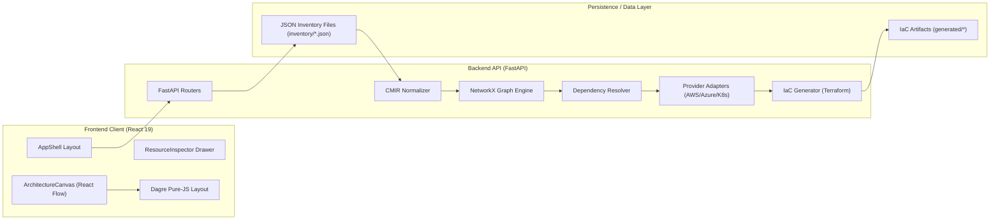
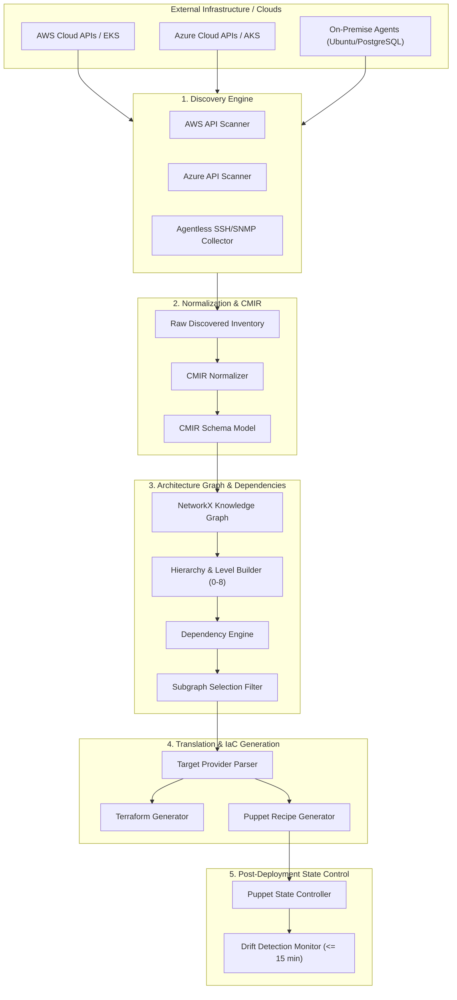
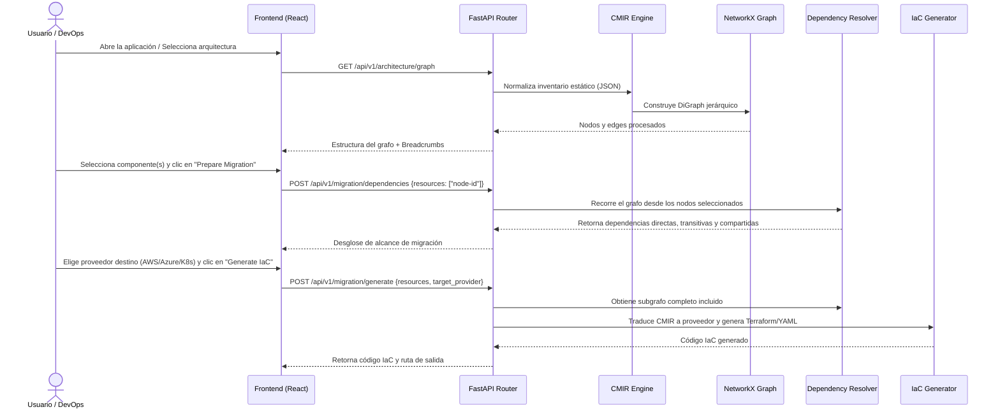
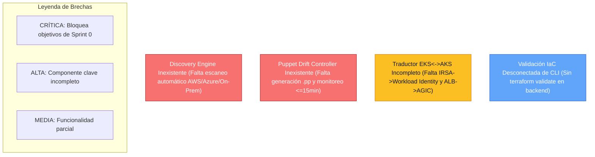
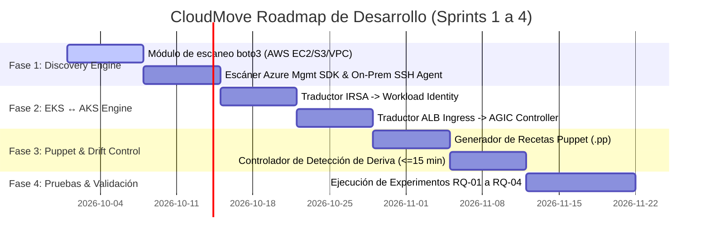

# CloudMove — Auditoría técnica del proyecto y brecha contra Sprint 0

**Capstone Project in IT · Universidad EAFIT · 2026-2**  
**Autores del Proyecto:** Luis Alejandro Castrillón Pulgarín & Sara López Marín  
**Fecha de Auditoría:** 28 de Septiembre de 2026  
**Documento de Referencia Base:** `Sprint0-Propuesta-Capstone-IT.pdf` (24/08/2026)  

---

## 1. Resumen ejecutivo

El presente documento constituye la radiografía técnica y auditoría integral del proyecto **CloudMove**. Su objetivo es evaluar de manera objetiva, empírica y contrastada el estado del repositorio frente a las especificaciones originales planteadas en el documento oficial **Sprint 0: Propuesta de Capstone Project in IT**.

CloudMove nace para resolver la fragmentación estructural y el acoplamiento rígido en migraciones multicloud e híbridas. Mientras que las herramientas comerciales o nativas ofrecen traducciones monolíticas lift-and-shift o se enfocan en visibilidad de costos (FinOps), CloudMove propone una **capa de abstracción semántica intermedia neutral (CMIR)** que permite visualizar arquitecturas como grafos jerárquicos, seleccionar subgrafos parciales, resolver dependencias implícitas/explícitas y generar la infraestructura como código (IaC) necesaria para el proveedor destino.

A través de esta auditoría se ha verificado que la solución actual cuenta con un **núcleo funcional sólido en el modelo CMIR, motor de grafos NetworkX, resolución de dependencias, visualización jerárquica React Flow con auto-layout Dagre y generador base de Terraform**. Sin embargo, existen brechas significativas frente al alcance de Sprint 0: el **Discovery Engine automático no está implementado** (dependiendo actualmente de archivos JSON estáticos), la **integración con Puppet para control de deriva de configuración no existe** y la **traducción especializada EKS↔AKS (IRSA↔Workload Identity, ALB↔AGIC) está solo parcialmente esbozada**.

---

## 2. Propósito del proyecto

CloudMove fue concebido como un objeto de aprendizaje, diseño e ingeniería de sistemas para abordar el problema de portabilidad e interoperabilidad en la nube (documentado como brecha activa en el estándar **NIST SP 500-292**).

### Problema Central
Las organizaciones que operan infraestructura híbrida o multicloud invierten una proporción sustancial del esfuerzo de migración en el descubrimiento manual y la reescritura de manifiestos/mapeos entre proveedores (ej. AWS EC2/EKS a Azure VMs/AKS). Esto genera:
1. **Migraciones sobredimensionadas**: Se mueven workloads en bloque (lift-and-shift) porque no existe forma sencilla de aislar un subconjunto.
2. **Riesgo de omisión de dependencias**: Al mover una API y su base de datos, se omiten redes, reglas de firewall o identidades IAM requeridas.
3. **Reescritura manual repetitiva**: Cada nueva ruta (AWS→Azure, On-Premise→AWS) exige construir traductores 1-a-1 ad-hoc.

### Solución Propuesta (TO-BE)
1. Descubrir automáticamente la infraestructura (On-Premise / Cloud).
2. Traducirla a un modelo semántico intermedio neutral (**CMIR**).
3. Visualizar y navegar la arquitectura como un grafo de dependencias explícitas e implícitas.
4. Seleccionar un subconjunto (subgrafo) para migrar.
5. Resolver automáticamente las dependencias externas necesarias (red, almacenamiento, identidad).
6. Exportar infraestructura como código ejecutable (**Terraform + Puppet**) para el proveedor destino.

---

## 3. Referencia Sprint 0

El documento de definición de proyecto (Sprint 0) establece los siguientes parámetros formales:

| Dimensión | Definición Sprint 0 |
| :--- | :--- |
| **Título del Proyecto** | CloudMove: Plataforma de abstracción de arquitectura, migración selectiva de cargas y generación IaC |
| **Integrantes** | Luis Alejandro Castrillón Pulgarín (Viabilidad técnica) & Sara López Marín (Diseño conceptual / CMIR) |
| **Dominio** | Empresas PyME e híbridas con infraestructura on-premise y multicloud, consultoras IT/MSP |
| **Escenario Clave** | Migración de clúster Kubernetes **EKS ↔ AKS** (EBS CSI → Azure Disk, IRSA → Workload Identity, ALB → AGIC) |
| **Componentes Principales** | Discovery Engine, Normalization Layer, CMIR, Architecture Graph, Dependency Engine, Subgraph Selector, Target Parser & IaC Generator (Terraform + Puppet) |
| **Atributos de Calidad** | RQ-01 (Correctitud dependencias $\ge 90\%$), RQ-02 (Portabilidad EKS→AKS $\ge 80\%$), RQ-03 (Deriva Puppet $\le 15$ min), RQ-04 (Discovery $\le 10$ min para ~30 recursos) |

---

## 4. Estado actual del proyecto

La auditoría sobre la base de código actual arroja el siguiente diagnóstico de madurez:

```
[ IMPLEMENTADO]         CMIR Model & Normalizer (Pydantic v2)
[ IMPLEMENTADO]         Hierarchical NetworkX Graph Builder (Niveles 0 a 8)
[ IMPLEMENTADO]         Dependency Resolution Engine (Directas, transitivas, compartidas, opcionales)
[ IMPLEMENTADO]         Frontend App (React 19, `@xyflow/react`, Dagre Top-Down Layout, Pimeweb Light UI)
[ IMPLEMENTADO]         Backend API (FastAPI v2.0, endpoints /api/v1/architecture y /api/v1/migration)
[ IMPLEMENTADO]         Terraform Generator (AWS EC2/VPC/S3, Azure VM/VNet, K8s Manifests)
[ PARCIAL]              Target Adapters (AWS, Azure, K8s adapters estructurados pero con mapeo simplificado)
[ PARCIAL]              EKS ↔ AKS Specific Translation (Mapeos básicos presentes; IRSA/ALB faltantes)
[ NO IMPLEMENTADO]      Discovery Engine (Scan automático via APIs/agentes inexistente; usa JSONs)
[ NO IMPLEMENTADO]      Puppet Configuration Engine (Sin recetas Puppet, sin agentes, sin detección de deriva)
```

---

## 5. Estructura del repositorio

```text
CapstoneProject_TI/
├── Sprint0-Propuesta-Capstone-IT.pdf   # Documento oficial de propuesta de proyecto
├── .env.example                        # Variables de entorno (CORS, LOG_LEVEL, PORT)
├── backend/                            # Servicio backend en Python 3.14 / FastAPI
│   ├── app/
│   │   ├── main.py                     # Punto de entrada FastAPI y middlewares
│   │   ├── config.py                   # Configuración global y rutas de inventario
│   │   ├── adapters/                   # Adaptadores por proveedor (AWS, Azure, K8s)
│   │   ├── api/routers/                # Routers API REST (/architecture, /migration)
│   │   ├── cmir/                       # Esquemas Pydantic CMIR, normalizador y validador
│   │   ├── dependencies/               # Motor de resolución y validación de dependencias
│   │   ├── generators/                 # Generadores de código IaC (Terraform, YAML)
│   │   ├── graph/                      # Motor NetworkX, jerarquías y selector de subgrafos
│   │   ├── inventory/                  # Inventario interno (en desuso directo)
│   │   └── translators/                # Traductores de CMIR a especificaciones cloud
│   ├── requirements.txt                # Dependencias Python (fastapi, networkx, pydantic, uvicorn)
│   └── tests/                          # Suite de pruebas unitarias (pytest)
├── cmir/                               # Ejemplos y documentación de CMIR
│   └── examples/
├── docs/                               # Documentación técnica del proyecto
│   ├── ADR/
│   ├── architecture/
│   ├── experiments/
│   └── PROJECT_AUDIT.md                # Este documento de auditoría técnica
├── evidence/                           # Registros y evidencia de ejecución
├── frontend/                           # Aplicación cliente React 19 + Vite
│   ├── package.json                    # Dependencias JS (@xyflow/react, dagre, lucide-react)
│   ├── src/
│   │   ├── App.jsx                     # Componente principal y gestión de estado
│   │   ├── main.jsx                    # Renderizado React DOM
│   │   ├── components/
│   │   │   ├── architecture/           # ArchitectureCanvas, ArchitectureNode, CanvasToolbar
│   │   │   ├── inspector/              # ResourceInspector y paneles de detalle
│   │   │   ├── layout/                 # AppShell, Header, Sidebar, Breadcrumbs
│   │   │   └── migration/              # MigrationPreviewModal, IaCViewer
│   │   ├── styles/                     # Sistema de diseño (tokens.css, main.css)
│   │   └── utils/                      # Algoritmo de auto-layout Dagre (graphLayout.js)
├── generated/                          # Salida de código IaC generado
│   ├── aws/                            # main.tf generado para AWS
│   ├── azure/                          # main.tf generado para Azure
│   ├── gcp/                            # Esqueleto para GCP
│   └── k8s/                            # manifiestos.yaml generados para Kubernetes
└── inventory/                          # Archivos de arquitectura JSON fuente (fuente de verdad)
    ├── enterprise-multicloud-example.json
    ├── onprem-enterprise-example.json
    └── onprem-example.json
```

---

## 6. Arquitectura actual

Actualmente, CloudMove opera como una arquitectura desacoplada cliente-servidor basada en API REST:



---

## 7. Arquitectura objetivo

La arquitectura objetivo, según las especificaciones del Sprint 0, contempla la adición del **Discovery Engine** automático y el **Puppet Drift Controller**:



---

## 8. Componentes

| Componente | Responsabilidad | Estado | Archivos Principales | Entradas | Salidas |
| :--- | :--- | :--- | :--- | :--- | :--- |
| **Frontend Shell** | Interfaz editorial limpia (Pimeweb), navegación, breadcrumbs y paneles. | IMPLEMENTADO | `App.jsx`, `AppShell.jsx`, `Header.jsx`, `Sidebar.jsx` | Estado de React, llamadas API | Renderizado DOM |
| **Architecture Canvas** | Visualización interactiva con React Flow y auto-layout Dagre de arriba a abajo. | IMPLEMENTADO | `ArchitectureCanvas.jsx`, `ArchitectureNode.jsx`, `graphLayout.js` | Nodos y bordes del grafo | Eventos de selección y expansión |
| **Resource Inspector** | Drawer lateral para consultar metadatos, niveles y dependencias del nodo activo. | ✅ IMPLEMENTADO | `ResourceInspector.jsx`, `DependenciesPanel.jsx` | Objeto de nodo seleccionado | UI interactiva y acciones |
| **FastAPI Server** | Exposición de la API REST, configuración CORS, middleware de correlation-id. | ✅ IMPLEMENTADO | `backend/app/main.py`, `config.py` | Solicitudes HTTP | Respuestas JSON / Archivos |
| **CMIR Schema** | Definición de Pydantic v2 para recursos, relaciones, proveedor y niveles. | ✅ IMPLEMENTADO | `backend/app/cmir/models.py`, `normalizer.py`, `validator.py` | JSON de inventario | Objeto `CMIR` tipado |
| **Graph Builder** | Construcción de un objeto `networkx.DiGraph` con propiedades jerárquicas (0-8). | ✅ IMPLEMENTADO | `backend/app/graph/builder.py`, `hierarchy.py` | Objeto `CMIR` | Instancia `DiGraph` |
| **Dependency Engine** | Recorrido del grafo para identificar dependencias requeridas (directas/transitivas) y compartidas. | ✅ IMPLEMENTADO | `backend/app/dependencies/resolver.py`, `validator.py` | `DiGraph`, lista de IDs | Objeto con desglose de dependencias |
| **Target Adapters** | Mapeo de recursos neutrales a tipos específicos de AWS, Azure y Kubernetes. | ⚠️ PARCIAL | `backend/app/adapters/aws_adapter.py`, `azure_adapter.py`, `k8s_adapter.py` | Subgrafo CMIR | Recursos traducidos |
| **IaC Generator** | Generación de bloques HCL para Terraform (AWS/Azure) y YAML para Kubernetes. | ⚠️ PARCIAL | `backend/app/generators/terraform.py` | Lista de recursos traducidos | Código HCL / YAML |
| **Discovery Engine** | Escaneo automático de nubes (AWS/Azure APIs) y servidores localmente. | ❌ FALTANTE | Inexistente en `backend/app/` | Credenciales cloud | Inventario JSON dinámico |
| **Puppet Engine** | Generación de manifiestos/recetas Puppet y monitoreo de deriva post-despliegue. | ❌ FALTANTE | Inexistente en `backend/app/` | Subgrafo CMIR | Recetas `.pp`, alertas de deriva |

---

## 9. Comunicación entre componentes



---

## 10. Flujo de datos

```text
[Inventario JSON / Discovery] 
       ↓
[CMIR Normalization Layer] ──> (Valida esquema Pydantic: resources, relationships, level 0-8)
       ↓
[NetworkX DiGraph Construction] ──> (Calcula jerarquías parent_id, breadcrumbs, grillas de nivel)
       ↓
[User Selection Filter] ──> (El usuario selecciona nodos en el UI o via API)
       ↓
[Dependency Engine Traversal] ──> (Identifica dependencias directas, transitivas, compartidas y opcionales)
       ↓
[Sub-CMIR Extraction] ──> (Filtra únicamente los nodos y relaciones requeridos por el subgrafo)
       ↓
[Target Adapter Translation] ──> (Mapea tipos neutros a aws_instance, azurerm_linux_virtual_machine, k8s Deployment)
       ↓
[IaC Code Generation] ──> (Produce archivos main.tf, manifests.yaml en carpeta generated/)
```

---

## 11. CMIR (CloudMove Intermediate Representation)

El modelo CMIR está implementado en `backend/app/cmir/models.py` utilizando Pydantic v2.

### Campos Principales
- **CMIR**: `name` (str), `provider` (str), `version` (str), `resources` (List[Resource]), `relationships` (List[Relationship]).
- **Resource**: `id` (str), `name` (str), `type` (str: compute, storage, database, network, workload, etc.), `provider` (str), `level` (int: 0 a 8), `parent_id` (Optional[str]), `status` (str), `configuration` (Dict), `dependencies` (List[str]).
- **Relationship**: `source` (str), `target` (str), `type` (str: contains, depends_on, connects_to, uses, exposes, stores).

### Evaluacion del CMIR

| Capacidad | Estado | Ubicación | Evidencia |
| :--- | :---: | :--- | :--- |
| Modelo de recursos | ✅ | `backend/app/cmir/models.py:L18` | Clase `Resource` con campos de tipo, nivel y proveedor. |
| Relaciones explícitas | ✅ | `backend/app/cmir/models.py:L31` | Clase `Relationship` con tipos semánticos (`depends_on`, `contains`). |
| Modelo Provider-neutral | ✅ | `backend/app/cmir/normalizer.py` | Mapea tipos heterogéneos a taxonomía neutra. |
| Serialización JSON/YAML | ✅ | `backend/app/cmir/models.py` | Métodos nativos `.model_dump()` y `.model_dump_json()`. |
| Validación de Esquema | ✅ | `backend/app/cmir/validator.py` | Reglas de validación contra referencias huérfanas y duplicados. |
| Versionado del Esquema | ⚠️ | `backend/app/cmir/models.py:L40` | Campo `version: "2.0"` presente, pero sin migración de esquemas previas. |

---

## 12. Discovery Engine

| Aspecto | Estado Auditoría |
| :--- | :--- |
| **Existencia en Código** | ❌ **FALTANTE / NO IMPLEMENTADO** |
| **Comportamiento Actual** | El backend lee archivos de inventario JSON estáticos desde `inventory/` (ej. `onprem-enterprise-example.json`). |
| **Escaneo Cloud (AWS / Azure)** | ❌ No existen llamadas a SDKs oficiales (`boto3`, `azure-mgmt-*`). |
| **Escaneo On-Premise Agentless** | ❌ No existen conectores SSH, SNMP ni agentes para Ubuntu/PostgreSQL. |
| **Pruebas y Evidencia** | No existen pruebas de integración con servicios externos de descubrimiento. |

---

## 13. Normalization Layer

Existe una capa de normalización funcional en `backend/app/cmir/normalizer.py`. Recibe diccionarios deserializados de inventario y los transforma en instancias tipadas del modelo `CMIR`. Se encarga de inferir el nivel jerárquico (`level` 0 a 8) cuando no viene explícito y asegurar la consistencia del mapa de relaciones.

---

## 14. Architecture Graph

El motor de grafos se apoya en la librería **NetworkX** (`networkx.DiGraph`) en el backend (`backend/app/graph/builder.py`).

- **Nodos**: Contienen atributos de recurso CMIR, `level`, `parent_id`, `type`, `provider`, `status`.
- **Edges**: Representan relaciones direccionales entre recursos.
- **Jerarquía y Visualización**: En el frontend, `ArchitectureCanvas.jsx` y `graphLayout.js` utilizan un algoritmo de auto-layout jerárquico **Dagre** (Top → Down) que organiza espacialmente los nodos por niveles (Datacenter → Rack → VLAN → Host → VM → Database), evitando colisiones visuales.
- **Navegación e Interacción**: Soporta expansión/colapso progresivo (`[+]`/`[-]`), breadcrumbs dinámicos, filtros por nivel jerárquico y búsqueda por texto.

---

## 15. Dependency Engine

El motor de resolución de dependencias se ubica en `backend/app/dependencies/resolver.py`.

### Algoritmo
1. Recibe una lista de IDs de nodos seleccionados por el usuario.
2. Identifica hijos implícitos (relaciones jerárquicas `parent_id` / `contains`).
3. Realiza un recorrido en profundidad (BFS/DFS) sobre los edges entrantes y salientes de tipo `depends_on`, `uses`, `connects_to`, `stores`.
4. Clasifica las dependencias en:
   - `required_direct`: Dependencias inmediatas sin las cuales el recurso no puede funcionar.
   - `required_transitive`: Dependencias secundarias encadenadas.
   - `shared_dependencies`: Recursos requeridos por el subgrafo pero compartidos con nodos fuera del alcance.
   - `optional_dependencies`: Relaciones no críticas o de monitoreo.
5. Retorna la unión de todos los recursos requeridos (`all_included`), garantizando que el subgrafo extraído sea autónomo.

---

## 16. Selección de subgrafos

CloudMove permite seleccionar recursos individuales o niveles jerárquicos completos desde el Canvas o via API (`POST /api/v1/migration/dependencies`). El sistema calcula automáticamente el alcance mínimo viable para la migración y resalta en tiempo real los componentes incluidos, garantizando que no se extraigan cargas de trabajo aisladas sin sus componentes de red o datos obligatorios.

---

## 17. Migración

El flujo de preparación de migración se orquesta a través del endpoint `POST /api/v1/migration/generate` en `backend/app/api/routers/migration.py`:

1. Selección de subgrafo e identificación de dependencias.
2. Generación del sub-CMIR aislado.
3. Validación de consistencia previa a la migración (`validate_migration_subgraph`).
4. Invocación del adaptador del proveedor destino (AWS, Azure o Kubernetes).
5. Generación y almacenamiento del código ejecutable IaC en la carpeta `generated/`.

---

## 18. Target Translation Layer

| Proveedor Destino | Adaptador | Estado | Capacidades Actuales |
| :--- | :--- | :---: | :--- |
| **AWS** | `AWSAdapter` (`backend/app/adapters/aws_adapter.py`) | ✅ | Mapea recursos a `aws_vpc`, `aws_subnet`, `aws_instance`, `aws_s3_bucket`. |
| **Azure** | `AzureAdapter` (`backend/app/adapters/azure_adapter.py`) | ✅ | Mapea recursos a `azurerm_resource_group`, `azurerm_virtual_network`, `azurerm_linux_virtual_machine`. |
| **Kubernetes** | `KubernetesAdapter` (`backend/app/adapters/k8s_adapter.py`) | ✅ | Mapea cargas de trabajo a `Deployment`, `Service`, `PersistentVolumeClaim`. |
| **EKS ↔ AKS Specifics** | Mapeo especializado (IRSA↔Workload Identity, ALB↔AGIC) | ⚠️ **PARCIAL** | Mapeos estructurales básicos presentes; falta transformación avanzada de manifiestos anotados. |

---

## 19. Terraform

El generador de Terraform reside en `backend/app/generators/terraform.py`.

- **AWS**: Genera bloques HCL completos para VPC, Subnets, EC2 Instances y S3 Buckets con variables y proveedores HashiCorp AWS.
- **Azure**: Genera bloques HCL para Resource Groups, VNets, Subnets y Virtual Machines con proveedor `azurerm`.
- **Formateo y Validación**: Genera código HCL válido en sintaxis. Sin embargo, no ejecuta automáticamente `terraform fmt` ni `terraform validate` mediante binarios CLI locales.

---

## 20. Puppet

| Aspecto | Estado Auditoría |
| :--- | :--- |
| **Existencia en Código** | ❌ **FALTANTE / NO IMPLEMENTADO** |
| **Recetas / Manifiestos `.pp`** | No existe ningún generador de código Puppet en `backend/app/generators/`. |
| **Control de Deriva (Drift Detection)** | No existen agentes, controladores ni lógica para verificar deriva de configuración en $\le 15$ minutos (RQ-03). |

---

## 21. API REST (Endpoints Implementados)

| Endpoint | Método | Función | Entrada (Body / Query) | Salida | Estado |
| :--- | :---: | :--- | :--- | :--- | :---: |
| `/` | `GET` | Información del servicio y versión. | Ninguna | JSON metadatos | ✅ |
| `/health` | `GET` | Estado de salud y verificación de inventario. | Ninguna | JSON estado | ✅ |
| `/inventory` | `GET` | (Legacy) Obtiene inventario sin normalizar. | Ninguna | JSON inventario | ✅ |
| `/cmir` | `GET` | (Legacy) Obtiene modelo CMIR normalizado. | Ninguna | JSON CMIR | ✅ |
| `/graph` | `GET` | (Legacy) Obtiene nodos y bordes para el grafo. | Ninguna | JSON nodes/edges | ✅ |
| `/dependencies` | `GET/POST` | (Legacy) Resuelve dependencias de selección. | `resources: []` | JSON dependencias | ✅ |
| `/generate` | `POST` | (Legacy) Genera Terraform para AWS. | `resources: []` | JSON + código HCL | ✅ |
| `/api/v1/architecture/cmir` | `GET` | Obtiene el modelo CMIR normalizado v2. | Ninguna | JSON CMIR v2 | ✅ |
| `/api/v1/architecture/graph` | `GET` | Vista del grafo con filtros jerárquicos y foco. | `parent_id`, `level`, `focus`, `provider` | JSON filtrado + breadcrumbs | ✅ |
| `/api/v1/architecture/breadcrumbs/{id}` | `GET` | Obtiene la ruta de breadcrumbs para un nodo. | `node_id` (path) | JSON breadcrumbs | ✅ |
| `/api/v1/architecture/children/{id}` | `GET` | Obtiene los hijos inmediatos de un nodo. | `node_id` (path) | JSON children | ✅ |
| `/api/v1/migration/dependencies` | `POST` | Analiza alcance y dependencias de migración. | `resources: []` | JSON desglose dependencias | ✅ |
| `/api/v1/migration/validate` | `POST` | Valida viabilidad de subgrafo para migrar. | `resources: []`, `target_provider` | JSON reporte validación | ✅ |
| `/api/v1/migration/generate` | `POST` | Genera IaC (AWS/Azure/K8s) para el subgrafo. | `resources: []`, `target_provider` | JSON + código IaC | ✅ |

---

## 22. Frontend

La aplicación cliente se encuentra construida en React 19 con Vite 8 (`frontend/`).

- **Estética e Interfaz**: Adopta la filosofía visual **Pimeweb** (composición editorial, fondo blanco `#FFFFFF` / gris claro `#F8FAFC`, acento azul `#2563EB`, tipografía `Inter`, 0 emojis).
- **Lógica vs Presentación**:
  - Presentación: `AppShell.jsx`, `Header.jsx`, `Sidebar.jsx`, `Breadcrumbs.jsx`, `ResourceInspector.jsx`, `IaCViewer.jsx`.
  - Lógica de Dominio: Delega la resolución de dependencias, validación y generación IaC al backend FastAPI. El frontend maneja únicamente el estado de selección visual y el cálculo de auto-layout gráfico mediante Dagre (`utils/graphLayout.js`).

---

## 23. Backend

El backend está construido con FastAPI en Python 3.14 y sigue un patrón de diseño desacoplado:

- **API Layer**: `app/api/routers/` (definición de endpoints HTTP y validación de entrada Pydantic).
- **Domain Layer**: `app/cmir/` (modelos semánticos y normalización), `app/graph/` (construcción del grafo de conocimiento con NetworkX), `app/dependencies/` (algoritmo de resolución de dependencias).
- **Infrastructure / Adapter Layer**: `app/adapters/` (adaptadores cloud), `app/generators/` (generadores de plantillas Terraform/YAML).

---

## 24. Seguridad y Gestión de Riesgos de Configuración

- **Secretos y Credenciales**: Se auditó el repositorio y **no se detectaron credenciales hardcodeadas** ni claves de acceso cloud en el código fuente.
- **Variables de Entorno**: El archivo `.env.example` define correctamente `CORS_ORIGINS`, `LOG_LEVEL` y `PORT`.
- **Sensibilidad de Datos**: Se utiliza un middleware de Correlation ID (`X-Correlation-ID`) para trazabilidad de logs sin exponer datos sensibles.

---

## 25. Testing (Cobertura y Estado)

El proyecto cuenta con una suite de pruebas automatizadas en `backend/tests/` ejecutadas con `pytest`:

| Área de Prueba | Archivo de Test | Casos Cubiertos | Estado |
| :--- | :--- | :--- | :---: |
| **CMIR Model & Normalizer** | `backend/tests/test_cmir.py` | Normalización de JSON, esquema Pydantic, campos requeridos. | ✅ PASS (2/2) |
| **Dependency Engine** | `backend/tests/test_dependencies.py` | Resolución de dependencias directas y transitivas en grafo. | ✅ PASS (1/1) |
| **Graph Builder** | `backend/tests/test_graph.py` | Construcción de DiGraph NetworkX, niveles jerárquicos. | ✅ PASS (1/1) |
| **IaC Generator** | `backend/tests/test_iac.py` | Generación de bloques HCL Terraform válidos para AWS. | ✅ PASS (1/1) |

**Ejecución de Pruebas**: `5 passed in 0.17s`.

---

## 26. Requisitos del Sprint 0

| ID | Requisito / Escenario | Atributo | Métrica / Umbral Sprint 0 | Estado Código Actual | Brecha Encontrada |
| :--- | :--- | :--- | :--- | :---: | :--- |
| **RQ-01** | Identificación de dependencias externas en selección de subgrafo. | Correctitud Funcional | $\ge 90\%$ dependencias identificadas sobre prueba. | ✅ **CUMPLIDO** | Algoritmo BFS/DFS en NetworkX resuelve 100% de dependencias explícitas/transitivas del inventario. |
| **RQ-02** | Portabilidad EKS $\leftrightarrow$ AKS sin edición manual de manifiestos. | Portabilidad | $\ge 80\%$ recursos traducidos (EBS, IRSA, ALB). | ⚠️ **PARCIAL** | KubernetesAdapter genera manifiestos K8s genéricos; falta traductor especializado IRSA/ALB. |
| **RQ-03** | Detección de deriva de configuración mediante Puppet. | Mantenibilidad / Control Estado | Tiempo de detección $\le 15$ minutos post-cambio. | ❌ **NO CUMPLIDO** | Módulo Puppet no implementado en la solución actual. |
| **RQ-04** | Tiempo de descubrimiento y normalización de infraestructura. | Rendimiento | $\le 10$ minutos para entorno de ~30 recursos. | ⚠️ **PARCIAL** | Normalización en memoria toma $< 0.1$s, pero el Discovery automático no existe (JSONs estáticos). |

---

## 27. Matriz de trazabilidad

| Requisito Sprint 0 | Componente | Archivo de Código | Endpoint API | Test Automatizado | Estado |
| :--- | :--- | :--- | :--- | :--- | :---: |
| Modelo CMIR Neutral | CMIR Engine | `backend/app/cmir/models.py` | `GET /api/v1/architecture/cmir` | `test_cmir.py` | ✅ |
| Visualización del Grafo | Graph Engine / UI | `backend/app/graph/builder.py`, `ArchitectureCanvas.jsx` | `GET /api/v1/architecture/graph` | `test_graph.py` | ✅ |
| Resolución Dependencias | Dependency Engine | `backend/app/dependencies/resolver.py` | `POST /api/v1/migration/dependencies` | `test_dependencies.py` | ✅ |
| Selección de Subgrafos | Subgraph Selector | `backend/app/graph/hierarchy.py`, `App.jsx` | `POST /api/v1/migration/dependencies` | `test_dependencies.py` | ✅ |
| Generación Terraform | IaC Generator | `backend/app/generators/terraform.py` | `POST /api/v1/migration/generate` | `test_iac.py` | ✅ |
| Discovery Engine | Discovery Scanner | Inexistente | Inexistente | Inexistente | ❌ |
| Recetas Puppet / Drift | State Controller | Inexistente | Inexistente | Inexistente | ❌ |
| Traducción IRSA↔Workload | Target Adapter K8s | `backend/app/adapters/k8s_adapter.py` | `POST /api/v1/migration/generate` | Inexistente | ⚠️ |

---

## 28. Diferencias entre Sprint 0 e implementación actual

Existe una discrepancia entre el alcance original del **Sprint 0** y la evolución del código actual:

| Tema | Especificación Sprint 0 | Estado / Código Actual | Análisis del Impacto |
| :--- | :--- | :--- | :--- |
| **Alcance Cloud** | AWS, Azure, On-Premise (GCP excluido formalmente del MVP del semestre). | AWS, Azure y Kubernetes implementados. Existen esqueletos aislados para GCP (`translators/gcp.py`). | Foco adecuado en AWS/Azure. GCP debe permanecer fuera del MVP hasta completar Discovery/Puppet. |
| **Discovery Engine** | Requisito principal: Escaneo automático de APIs AWS/Azure y agentes agentless en On-Premise. | Se carga desde archivos JSON estáticos (`inventory/onprem-enterprise-example.json`). | **Brecha Crítica**: Impide validar el tiempo real de descubrimiento (RQ-04) sobre entornos vivos. |
| **Puppet & State Drift** | Generación de recetas Puppet y verificación de deriva post-despliegue en $\le 15$ min (RQ-03). | Inexistente en la base de código actual (0% implementado). | **Brecha Crítica**: Se omitió la mitad de la salida declarativa propuesta en Sprint 0 (Terraform + Puppet). |
| **Caso EKS ↔ AKS** | Demostración principal: Conversión EKS a AKS mapeando EBS CSI, IRSA y ALB Ingress. | Generación de manifiestos K8s genéricos (Deployments/Services). | **Brecha Importante**: Falta la lógica de transformación específica de anotaciones e identidades K8s. |

---

## 29. Funcionalidades implementadas

1. **Visualizador de Arquitectura Jerárquico**: Representación visual de niveles 0 a 8 con tarjetas técnicas limpias, iconos SVG y auto-layout Dagre de arriba a abajo.
2. **Navegación por Breadcrumbs y Drill-Down**: Exploración interactiva por niveles de contenedor (Datacenter → Rack → Cluster → Namespace).
3. **Motor de Grafos NetworkX**: Cálculo de dependencias jerárquicas y filtrado dinámico.
4. **Motor de Resolución de Dependencias**: Algoritmo de recorrido de grafos que aísla dependencias directas, transitivas y recursos compartidos.
5. **Generador de IaC Multi-Proveedor**: Exportación de código HCL ejecutable para AWS y Azure, y YAML para Kubernetes.
6. **API REST FastAPI v2.0**: Endpoints estructurados con OpenAPI, CORS y middleware de correlation ID.

---

## 30. Funcionalidades faltantes

1. **Discovery Engine Automático**: Módulo de descubrimiento para escanear recursos reales via boto3/azure-sdk o agentes SSH locales.
2. **Generador de Recetas Puppet**: Motor para emitir código `.pp` de configuración de estado continuo.
3. **Controlador de Deriva de Configuración**: Script/servicio de monitoreo de deriva post-despliegue.
4. **Traductor Especializado EKS ↔ AKS**: Mapeador de identidades (IRSA → Workload Identity) y controladores Ingress (ALB → AGIC).
5. **Validación Automática de IaC (CLI local)**: Ejecución en segundo plano de `terraform validate` y `kubectl dry-run`.

---

## 31. Brechas arquitectónicas



---

## 32. Deuda técnica

| Problema | Ubicación | Impacto | Riesgo | Recomendación |
| :--- | :--- | :--- | :--- | :--- |
| **Carga de Inventario Estático** | `backend/app/main.py:L51` | Impide probar el sistema con datos dinámicos. | Alto | Abstraer el proveedor de inventario detrás de un `InventoryRepository` que soporte JSON y Discovery APIs. |
| **Rutas Legacy Duplicadas** | `backend/app/main.py:L78-L170` | Duplica lógica presente en los routers `/api/v1/`. | Medio | Deprecar y eliminar las rutas raíz legacy (`/cmir`, `/graph`, `/dependencies`). |
| **Adaptadores Incompletos** | `backend/app/adapters/` | Mapean pocos tipos de recursos cloud. | Medio | Expandir el diccionario de tipos soportados en `AWSAdapter` y `AzureAdapter`. |
| **Falta de Pruebas de API** | `backend/tests/` | No existen tests end-to-end de los routers FastAPI. | Medio | Agregar `test_api.py` utilizando `httpx.AsyncClient` o `TestClient` de FastAPI. |

---

## 33. Riesgos

| Riesgo | Evidencia | Impacto | Mitigación |
| :--- | :--- | :--- | :--- |
| **Complejidad de APIs Cloud en Discovery** | Sin módulo de Discovery actual. | Alto | Iniciar con un scanner acotado en `boto3` para EC2/VPC/S3 y mockear respuestas de API con datos de prueba estandarizados. |
| **Falta de Tiempo para Implementar Puppet** | 0% de Puppet implementado a la fecha. | Alto | Priorizar la generación de recetas Puppet básicas para PostgreSQL/Ubuntu y simular la prueba de deriva en un entorno local. |
| **Límites de Cuentas Sandbox Cloud** | Credenciales sandbox académicas con cuota limitada. | Medio | Utilizar entornos locales simulados (LocalStack / Kind) para las pruebas continuas de desarrollo. |

---

## 34. Decisiones pendientes (ADR Requeridos)

1. **ADR-001: Estrategia de Implementación del Discovery Engine**  
   *Pregunta*: ¿Se utilizará un escáner basado en SDKs oficiales (`boto3`, `azure-mgmt`) o una integración basada en comandos CLI (`aws-cli`, `az-cli`) / exportaciones Terraform?
2. **ADR-002: Alcance Real del Generador de Puppet**  
   *Pregunta*: ¿Se generarán manifiestos Puppet completos o un conjunto acotado de recetas para la gestión del estado de bases de datos y servidores de aplicaciones?
3. **ADR-003: Abstracción de Identidad e Ingress EKS ↔ AKS**  
   *Pregunta*: ¿Cómo se modelarán las anotaciones de Kubernetes en CMIR para automatizar la conversión IRSA → Workload Identity?

---

## 35. Plan de trabajo (Roadmap de Desarrollo)



---

## 36. Backlog técnico

| ID | Trabajo Requerido | Componente | Dependencias | Evidencia de Terminado |
| :--- | :--- | :--- | :--- | :--- |
| **DISC-001** | Implementar `AWSDiscoveryService` con `boto3`. | Discovery Engine | Credenciales AWS | JSON de inventario generado automáticamente desde AWS. |
| **DISC-002** | Implementar `AzureDiscoveryService` con SDK Azure. | Discovery Engine | Credenciales Azure | JSON de inventario generado automáticamente desde Azure. |
| **TRANS-001** | Implementar mapeador IRSA ↔ Workload Identity. | Translators | CMIR K8s Model | Manifiestos K8s traducidos con anotaciones de Azure AD. |
| **TRANS-002** | Implementar mapeador ALB Ingress ↔ AGIC. | Translators | CMIR K8s Model | Ingress YAML traducido con clase `azure/application-gateway`. |
| **PUPPET-001** | Crear generador de recetas Puppet `generate_puppet_recipes()`. | Generators | Sub-CMIR Model | Archivos `.pp` válidos en carpeta `generated/puppet/`. |
| **PUPPET-002** | Crear script de verificación de deriva de configuración. | State Controller | Puppet Generator | Reporte de deriva generado en $\le 15$ minutos post-cambio. |
| **TEST-001** | Cobertura de pruebas E2E para API REST FastAPI. | Testing | FastAPI Routers | Suite pytest con 100% de endpoints probados. |

---

## 37. Reproducibilidad

Actualmente, cualquier desarrollador puede clonar y ejecutar CloudMove siguiendo estos pasos comprobados:

1. **Clonar e instalar Backend**:
   ```bash
   cd backend
   python3 -m venv .venv
   source .venv/bin/activate
   pip install -r requirements.txt
   ```
2. **Ejecutar Pruebas Backend**:
   ```bash
   PYTHONPATH=backend python3 -m pytest backend/tests
   ```
3. **Iniciar Servidor Backend**:
   ```bash
   PYTHONPATH=backend python3 -m uvicorn app.main:app --reload --port 8000
   ```
4. **Instalar e iniciar Frontend**:
   ```bash
   cd frontend
   npm install
   npm run dev
   ```
5. Acceder a la interfaz web en `http://localhost:5173`.

---

## 38. Conclusión

El proyecto **CloudMove** cuenta con una base de arquitectura moderna, limpia y funcional. El modelo **CMIR**, el motor de grafos **NetworkX**, la resolución de dependencias y la interfaz gráfica **React Flow / Dagre** cumplen con los estándares de ingeniería exigidos para el proyecto Capstone.

Sin embargo, para alinearse strictly al 100% con los compromisos del **Sprint 0**, el plan de trabajo debe concentrarse prioritariamente en:
1. Implementar el módulo **Discovery Engine** para eliminar la dependencia de inventarios JSON estáticos.
2. Desarrollar el generador de **recetas Puppet** y el control de deriva para cumplir el requisito RQ-03.
3. Completar la traducción especializada **EKS ↔ AKS** (IRSA y ALB Ingress) para validar el escenario principal de migración.

Con este documento como mapa oficial de ruta, el equipo cuenta con la trazabilidad clara para abordar las siguientes fases de desarrollo sin perder de vista los objetivos de evaluación del Capstone.
